# 系统架构

## 当前实现范围

当前仓库处于从零搭建阶段，已落地部分包括 BookStack 扩展层、AI Gateway、核心存储层、索引任务队列、内容索引流水线、PDF 附件解析接入、站内检索与 `SSE` 流式回答、外部 `RAG API` 的 `API Key` 治理、内部审计与观测，以及内容生命周期管理骨架。

## 目录结构

```text
src/
  index.js
  ai-gateway/
    apiAccessManager.js
    app.js
    auditLogger.js
    authContextResolver.js
    config.js
    health.js
    inferenceAdapter.js
    logger.js
    promptOrchestrator.js
    retrievalService.js
  index-worker/
    idempotency.js
    indexQueue.js
    memoryStreamClient.js
    queueConfig.js
  indexing/
    chunker.js
    contentLifecycle.js
    documentParseClient.js
    embeddingProvider.js
    indexingPipeline.js
    normalizer.js
  storage/
    migrations.js
    repositories.js
    schema.js
    validators.js
  bookstack-extension/
    aiGatewayClient.js
    bookstackAiExtension.js
    pageEvents.js
    queryScope.js
    sidebarState.js
```

## 模块关系

```mermaid
graph TD
    G["aiGatewayApp"] --> H["authContextResolver"]
    G --> I["retrievalService"]
    G --> J["promptOrchestrator"]
    G --> K["inferenceAdapter"]
    G --> L["auditLogger"]
    G --> M["apiAccessManager"]
    G --> N["healthService"]
    Q["indexQueue"] --> R["memoryStreamClient"]
    Q --> W["queueConfig"]
    Q --> X["idempotency"]
    Q --> S
    Y["indexingPipeline"] --> Z["normalizer"]
    Y --> AA["chunker"]
    AD["contentLifecycleManager"] --> S
    Y --> AB["embeddingProvider"]
    Y --> AC["documentParseClient"]
    Y --> S
    S["storageRepositories"] --> T["schema"]
    S --> U["validators"]
    S --> V["migrations"]
    A["bookstackAiExtension"] --> B["aiGatewayClient"]
    A --> C["queryScope"]
    A --> D["pageEvents"]
    A --> E["sidebarState"]
    F["src/index.js"] --> A
    F --> G
    F --> Q
    F --> Y
    F --> S
    F --> B
    F --> C
    F --> D
    F --> E
```



## 模块职责

- `aiGatewayClient.js`: 封装同步问答、`SSE` 问答、索引事件和健康检查请求，以及错误映射。
- `ai-gateway/config.js`: 管理 AI Gateway 环境配置、模型参数和基础指标默认值。
- `ai-gateway/authContextResolver.js`: 校验服务级 Bearer Token 并提取租户、用户和范围上下文。
- `ai-gateway/retrievalService.js`: 负责活动 chunk 的租户、权限、语言和范围过滤，并生成引用结果。
- `ai-gateway/promptOrchestrator.js`: 负责问题、引用证据和证据不足提示的提示词编排。
- `ai-gateway/inferenceAdapter.js`: 提供同步回答和 `SSE` 事件流推理适配入口，当前为可测试 stub 实现。
- `ai-gateway/auditLogger.js`: 记录请求级审计信息。
- `ai-gateway/auditLogger.js`: 提供审计记录写入、脱敏查询和保留期清理。
- `ai-gateway/apiAccessManager.js`: 负责外部 `API Key` 鉴权、白名单范围收缩和限流检查。
- `ai-gateway/health.js`: 输出健康状态、依赖服务状态和观测指标。
- `ai-gateway/app.js`: 聚合内部问答、外部 `RAG API`、索引事件、健康检查、审计查询、观测接口、鉴权、日志和审计。
- `index-worker/queueConfig.js`: 定义 `index_events`、`index_events_retry`、`index_events_dlq` 和 consumer group 配置。
- `index-worker/idempotency.js`: 生成 `event_id + entity_id + version_ts` 幂等键，并记录已处理事件。
- `index-worker/memoryStreamClient.js`: 提供内存版 stream client，模拟 Redis Streams 行为。
- `index-worker/indexQueue.js`: 实现入队、消费、重试、死信和 `index_job` 状态流转骨架。
- `indexing/normalizer.js`: 统一处理 HTML 和 Markdown 正文，保留标题层次、路径和锚点。
- `indexing/chunker.js`: 按中文句段切片并生成内容哈希。
- `indexing/contentLifecycle.js`: 处理页面删除、附件删除、权限收缩、租户清理和重建计划。
- `indexing/documentParseClient.js`: 封装独立文档解析服务的页数、文件大小和超时约束。
- `indexing/embeddingProvider.js`: 提供托管中文 embedding 服务的适配器骨架。
- `indexing/indexingPipeline.js`: 串联正文与 PDF 附件的标准化、切片、embedding 和存储写入，并处理旧版本 chunk 失活与失败回写。
- `storage/schema.js`: 定义 `pgvector` 扩展、核心表和索引 SQL。
- `storage/migrations.js`: 输出初始迁移计划和语句集合。
- `storage/validators.js`: 校验 `knowledge_chunk`、`index_job`、`ai_query_log`、`api_client`、`embedding_profile` 记录约束。
- `storage/repositories.js`: 提供内存版 repository 骨架，包含 `API Key` 客户端查询接口。
- `queryScope.js`: 构造当前页、当前书、当前用户可访问范围三种查询上下文。
- `pageEvents.js`: 统一发布页面创建、更新、删除、移动事件。
- `sidebarState.js`: 管理可收起侧边栏的持久化状态与当前会话。
- `bookstackAiExtension.js`: 聚合同步问答、流式问答、页面事件和侧边栏会话状态，形成 BookStack 扩展层入口。
