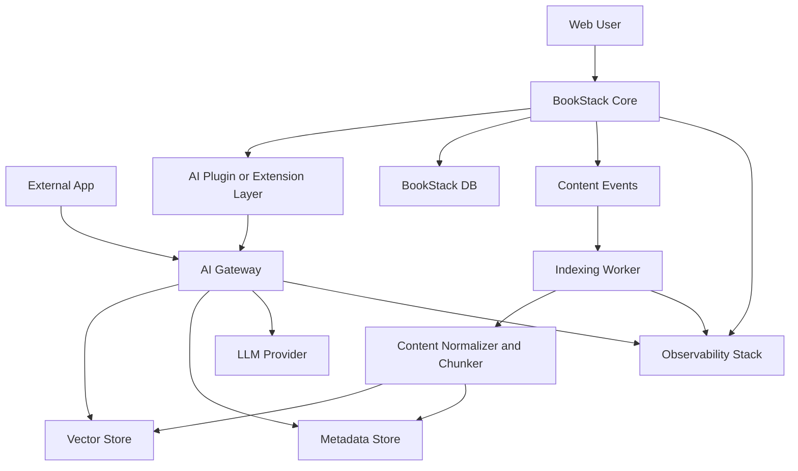

# BookStack-AI Technical Design

Feature Name: bookstack-ai-knowledge-hub
Updated: 2026-07-01

## Description

本方案将 BookStack 定位为企业知识内容与权限事实源，将 AI 能力抽离为独立服务。整体目标是以最小侵入方式扩展 BookStack，在原有内容生命周期和权限体系之上增加智能问答、知识索引流水线和可开放集成的 RAG API。

方案核心原则：

- BookStack 继续负责内容管理、用户会话和权限判定。
- AI Gateway 负责检索增强生成、对接模型供应商和开放 API。
- 索引过程以异步流水线运行，避免编辑链路被 AI 耗时流程阻塞。
- 检索与回答全链路继承 BookStack 权限和租户边界。

## Architecture



### 架构说明

1. `BookStack Core` 作为现有知识库主系统保持主体功能不变。
2. `AI Plugin or Extension Layer` 是 BookStack 内的轻量扩展层，用于发起 AI 请求、展示问答结果、同步鉴权上下文、订阅内容变更事件。
3. `AI Gateway` 是独立服务，提供内部问答接口与外部 RAG API，封装检索、重排、提示词编排、模型调用和审计。
4. `Indexing Worker` 异步消费内容事件，对页面进行文本标准化、切片、向量化和元数据入库。
5. `Vector Store` 存储 embedding 向量，`Metadata Store` 存储可检索元数据和审计信息。

## Components and Interfaces

### 0. 已确认选型

- 前端扩展形态：轻量插件式，AI 入口嵌入 BookStack 页面与导航。
- 后端扩展形态：旁路式，AI Gateway 与 Indexing Worker 独立部署。
- 外部 RAG API 鉴权：`API Key`。
- 外部 RAG API 授权粒度：按租户和书架/书籍白名单控制。
- 向量库：`PostgreSQL + pgvector`。
- 索引任务队列：`Redis Streams`。
- Embedding 策略：第一期仅支持中文知识，按语言独立 embedding，当前只启用中文索引与检索链路。
- Embedding 来源：托管中文 embedding 服务，通过统一 `Embedding Provider` 抽象接入。
- 首期索引范围：页面正文与 PDF 附件。
- PDF 解析方式：独立文档解析服务，由 `Indexing Worker` 异步调用。
- 问答输出：首期支持流式输出，同时保留非流式响应模式。
- 流式协议：`SSE`。
- 站内问答主入口：页面侧边栏。
- 站内问答次入口：全局顶部入口。
- 页面侧边栏交互：可收起的折叠抽屉。
- 默认查询范围：当前页，可切换到当前书和当前用户可访问知识范围。
- 暂缓范围：评论、图片 OCR、Office 文档、自定义字段。

### 1. BookStack 扩展层

职责：

- 在页面侧边栏提供主“智能问答”入口，并在全局导航提供次入口。
- 将当前用户身份、租户上下文、访问范围、查询内容发送到 AI Gateway。
- 订阅页面创建、更新、移动、删除事件，推送索引任务。
- 呈现答案、引用来源、失败状态和审计请求号。

接口建议：

- `POST /internal/ai/query`
- `POST /internal/ai/index/events`
- `GET /internal/ai/health`

### 2. AI Gateway

职责：

- 校验来自 BookStack 的用户上下文和服务身份。
- 解析查询范围，构建检索条件。
- 执行 retrieval、rerank、prompt assembly、LLM inference。
- 向 BookStack UI 返回结构化回答。
- 对外暴露带鉴权和限流的 RAG API。

内部模块：

- `Auth Context Resolver`
- `Retrieval Service`
- `Prompt Orchestrator`
- `Inference Adapter`
- `Audit Logger`
- `API Access Manager`

### 3. Indexing Worker

职责：

- 接收内容变更事件。
- 基于 `Redis Streams consumer group` 消费索引任务。
- 拉取页面完整内容与层级信息。
- 统一处理 HTML、Markdown、PDF 附件文本抽取的标准化输出。
- 调用独立文档解析服务完成 PDF 文本抽取与页码定位。
- 生成 chunk，并写入向量与元数据存储。
- 更新版本状态，处理重试和死信任务。

### 4. 向量与元数据存储

职责：

- 按租户、权限范围、文档层级、语言和时间维度过滤内容。
- 支持 chunk 检索、来源追踪和增量更新。
- 支持删除和内容失效传播。

可选技术：

- 向量存储：`pgvector`。
- 元数据存储：PostgreSQL。
- 队列：`Redis Streams`。

## Key Flows

### 1. 站内智能问答流程

1. 用户在 BookStack 页面侧边栏主入口或全局顶部次入口发起问题。
2. BookStack 扩展层提取用户身份、当前页上下文、租户和权限摘要。
3. AI Gateway 校验服务签名，并将用户可访问范围转换为检索过滤条件。
4. Retrieval Service 从向量库检索候选 chunk，并按层级路径和相关性重排。
5. Prompt Orchestrator 组装系统提示、引用内容和用户问题。
6. Inference Adapter 调用 LLM，生成答案和引用。
7. Audit Logger 记录问题、检索证据、模型元数据和响应状态。
8. BookStack UI 渲染答案、来源链接和请求编号。

### 2. 索引更新流程

1. 页面内容变更后，BookStack 触发事件。
2. Indexing Worker 消费事件，并读取页面正文、所属书架路径、标签和权限信息。
3. Content Normalizer 将 HTML 或 Markdown 转换为统一文本表示，保留标题层次和引用锚点。
4. Chunker 按语义段落和长度阈值切片。
5. Embedding 生成后写入 Vector Store，同步元数据到 Metadata Store。
6. 旧版本 chunk 标记为失效或删除。
7. 任务状态写入索引任务表，供管理端查看与重试。

### 3. 外部 RAG API 流程

1. 外部系统使用 `API Key` 访问 AI Gateway。
2. API Access Manager 解析客户端身份、租户和允许访问的知识范围。
3. Retrieval 与生成流程复用站内问答能力。
4. API 同时支持流式与非流式响应，并返回 `answer`、`citations`、`request_id`、`usage` 和 `latency_ms`。

## Suggested APIs

### Internal Query API

```json
POST /internal/ai/query
{
  "request_id": "uuid",
  "tenant_id": "tenant-01",
  "user_id": "user-1001",
  "scopes": {
    "shelves": [1, 2],
    "books": [10, 11],
    "chapters": [],
    "pages": [101]
  },
  "question": "如何接入单点登录？",
  "context_page_id": 101,
  "conversation_id": "optional-uuid"
}
```

```json
{
  "request_id": "uuid",
  "answer": "可以通过 SAML 或 OIDC 集成企业身份源。",
  "citations": [
    {
      "page_id": 101,
      "page_title": "认证配置",
      "path": "平台手册/认证/认证配置",
      "anchor": "oidc",
      "snippet": "系统支持 OIDC 配置..."
    }
  ],
  "usage": {
    "prompt_tokens": 1200,
    "completion_tokens": 220
  },
  "latency_ms": 1840
}
```

### External RAG API

```json
POST /v1/rag/query
{
  "knowledge_scope": "workspace-default",
  "query": "报销流程审批节点有哪些？",
  "top_k": 5,
  "stream": false
}
```

```text
Content-Type: text/event-stream

event: start
data: {"request_id":"uuid"}

event: delta
data: {"text":"第一段回答"}

event: citation
data: {"page_id":101,"anchor":"oidc"}

event: done
data: {"latency_ms":1840}
```

### Index Event API

```json
POST /internal/ai/index/events
{
  "event_id": "uuid",
  "event_type": "page.updated",
  "tenant_id": "tenant-01",
  "page_id": 101,
  "occurred_at": "2026-07-01T10:00:00Z"
}
```

## Data Models

### 1. `knowledge_chunk`

- `chunk_id`
- `tenant_id`
- `page_id`
- `book_id`
- `chapter_id`
- `shelf_id`
- `path_text`
- `content_text`
- `content_hash`
- `chunk_index`
- `embedding_model`
- `permission_scope_hash`
- `language`
- `version_ts`
- `is_active`

### 2. `index_job`

- `job_id`
- `tenant_id`
- `entity_type`
- `entity_id`
- `event_type`
- `status`
- `attempt_count`
- `failure_reason`
- `queued_at`
- `processed_at`

### 3. `ai_query_log`

- `request_id`
- `tenant_id`
- `channel`
- `user_id_or_client_id`
- `question_text`
- `retrieved_chunk_ids`
- `answer_summary`
- `model_name`
- `prompt_tokens`
- `completion_tokens`
- `latency_ms`
- `status`
- `created_at`

### 4. `api_client`

- `client_id`
- `tenant_id`
- `credential_ref`
- `allowed_scope`
- `rate_limit_policy`
- `status`
- `created_at`

### 5. `embedding_profile`

- `profile_id`
- `language_code`
- `embedding_provider`
- `embedding_model`
- `dimension`
- `is_active`
- `created_at`

## Correctness Properties

1. 每次检索都必须先完成租户过滤，再完成权限过滤，再执行相似度召回。
2. 任意回答返回的引用必须来自本次检索命中的有效 chunk。
3. 页面删除、失效或权限收缩后，相关 chunk 必须在后续检索中不可见。
4. BookStack Core 故障不会破坏已入库索引数据，AI Gateway 故障不会中断 BookStack 的基础浏览编辑能力。
5. 审计日志中的 `request_id` 在站内问答与外部 API 链路中全局唯一。

## Security and Permission Design

1. BookStack 与 AI Gateway 使用服务级签名或 mTLS 通信。
2. BookStack 用户态权限由 BookStack 计算后下发为可验证上下文，AI Gateway 只执行收缩后的检索范围。
3. 外部 RAG API 使用独立 `API Key` 凭据体系，与 BookStack 用户登录态隔离。
4. 模型供应商密钥只保存在 AI Gateway 侧的密钥管理系统。
5. 审计日志对敏感内容支持脱敏和保留期配置。

## Retrieval and Embedding Strategy

1. 第一阶段仅索引中文页面内容，非中文页面不进入默认检索链路。
2. 每个语言维护独立 embedding profile，检索请求按语言路由到对应向量空间。
3. 当前仅启用 `zh-CN` profile，后续新增英文或其他语言时复用同一模型抽象与路由机制。
4. 检索流程先按租户和权限过滤，再按 `language_code` 过滤，再执行向量召回。
5. Embedding 调用通过 `Embedding Provider` 接口封装，当前默认指向托管中文 embedding 服务。

## Content Ingestion Scope

1. 第一阶段纳入索引的数据源为 BookStack 页面正文和 PDF 附件。
2. 页面正文同时支持 HTML 编辑内容和 Markdown 编辑内容的统一标准化。
3. PDF 附件通过独立文档解析服务异步抽取文本后纳入索引，并保留附件来源关联与页码定位信息。
4. 评论、图片 OCR、Office 文档、自定义字段保留到后续阶段扩展。

## Streaming Response Strategy

1. 站内问答首期支持流式输出，前端通过增量渲染提升响应体感。
2. 外部 RAG API 同时提供 `stream=true` 和 `stream=false` 两种调用方式。
3. 流式输出过程中先返回 `request_id` 与首批状态事件，再持续返回 token 增量和引用补充事件。
4. 当流式生成中断时，AI Gateway 记录中断原因，并将已生成内容标记为部分完成状态。
5. 流式传输协议采用 `SSE`，响应类型为 `text/event-stream`。
6. 标准事件类型包括 `start`、`delta`、`citation`、`done` 和 `error`。

## Frontend Interaction Strategy

1. 页面侧边栏作为站内问答主入口，优先服务当前页面相关提问。
2. 全局顶部入口作为次入口，承接跨页面或全局知识问答。
3. 默认检索范围为当前页，用户可切换到当前书和当前用户可访问知识范围。
4. 页面侧边栏采用可收起的折叠抽屉，支持展开、收起和保留当前会话状态。
5. 回答区域显示当前检索范围、引用来源和可回跳的页面或附件定位。

## Document Parsing Service Design

1. 文档解析服务对外暴露统一附件文本抽取接口，首期仅开启 PDF 解析能力。
2. `Indexing Worker` 通过异步任务调用解析服务，接收纯文本、页码片段、解析状态和错误信息。
3. 解析服务需要配置单文件大小、页数和超时时间限制，避免长任务拖垮索引链路。
4. 解析结果按 `attachment_id` 和 `page_no` 持久化，供引用展示和回溯。

## Queue Strategy

1. 索引任务队列采用 `Redis Streams`。
2. `Indexing Worker` 使用 `consumer group` 模式消费，支持多实例横向扩展。
3. 事件主流命名为 `index_events`，重试流命名为 `index_events_retry`，死信流命名为 `index_events_dlq`。
4. 重试策略采用固定阶梯退避或指数退避，最大重试次数控制在 3 到 5 次。
5. 消费幂等键采用 `event_id + entity_id + version_ts`，避免重复索引。

## Deployment Plan

### 逻辑部署

- `bookstack-web`: 现有 BookStack 应用与前端。
- `ai-gateway`: 独立 API 服务。
- `index-worker`: 异步索引任务处理服务。
- `queue`: `Redis Streams` 事件与任务队列。
- `postgres`: BookStack 业务库和 AI 元数据存储，可同实例分库或独立实例。
- `vector-store`: 向量数据库。
- `observability`: 日志、指标、链路追踪。

### 演进路径

1. Phase 1: 站内问答 MVP，支持页面级引用和手动全量索引。
2. Phase 2: 增量索引、权限过滤、问答审计、管理端任务重试。
3. Phase 3: 对外 RAG API、多租户隔离、限流与配额治理。
4. Phase 4: 多语言索引、混合检索、重排、多模型路由和成本优化。

## Error Handling

1. 当向量检索不可用时，AI Gateway 返回可观察错误码，并记录降级状态。
2. 当模型推理超时或限流时，AI Gateway 返回带 `request_id` 的失败响应，便于排障。
3. 当索引任务失败时，任务状态进入 `failed`，保留错误原因与重试次数。
4. 当 BookStack 提供的权限上下文校验失败时，AI Gateway 拒绝请求并记录安全事件。
5. 当引用源页面已失效时，回答流程重新检索并过滤失效 chunk。
6. 当文档解析服务超时或失败时，附件索引任务记录失败状态，并保留人工重试入口。
7. 当流式响应中断时，AI Gateway 结束流并输出结构化终止事件。
8. 当 `Redis Streams` 发生重复投递或超时重领时，`Indexing Worker` 基于幂等键跳过重复处理。

## Test Strategy

1. 单元测试覆盖权限过滤、chunk 构造、检索条件生成、API 认证和错误映射。
2. 集成测试覆盖 BookStack 事件到索引入库的全链路。
3. 端到端测试覆盖站内问答、引用跳转、外部 API 调用和限流策略。
4. 回归测试覆盖页面删除、权限变更、租户切换和索引重建。
5. 性能测试覆盖大规模页面导入、并发问答和向量检索延迟。

## Open Decisions

1. BookStack 前端轻量插件采用官方扩展点、主题注入，还是定制前端资源挂载。
